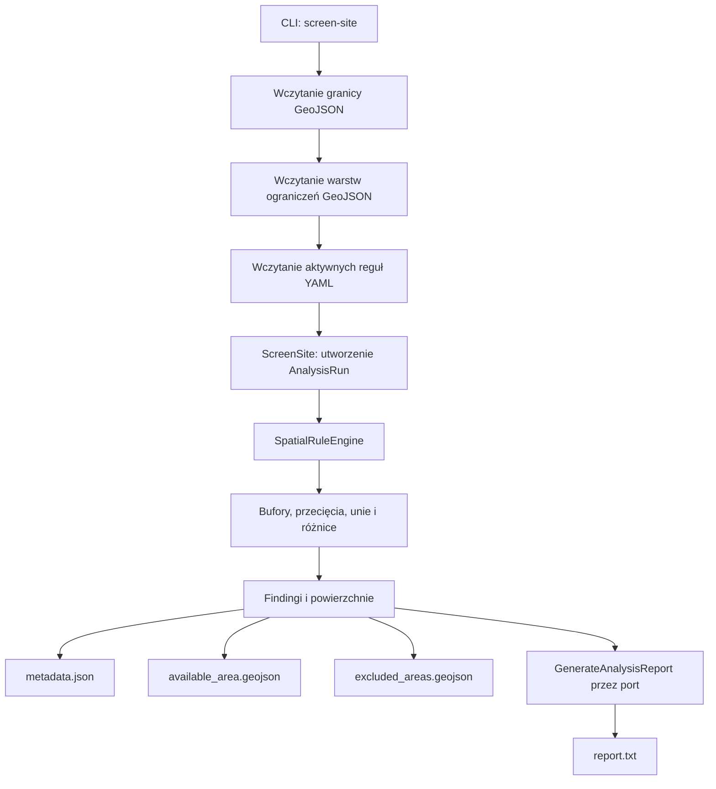

# Architektura

## Podejście

System jest modularnym monolitem z architekturą portów i adapterów. Logika
domenowa nie zna GeoPandas, PyProj, PyWake, pvlib, bazy danych ani frameworka
interfejsu.

## Warstwy

1. **Domain** — niemutowalne modele `Project`, `Site`, `Scenario`,
   `SpatialConstraint`, `EnergyProfile`, `AnalysisRun`, `ConstraintFinding`
   oraz neutralne reprezentacje geometrii i CRS.
2. **Application** — przypadki użycia `ScreenSite` i
   `GenerateAnalysisReport`; koordynują repozytoria, dostawców danych,
   evaluator reguł i generator raportu.
3. **Ports** — protokoły repozytoriów, dostawców warstw i reguł, operacji
   przestrzennych oraz `AnalysisReportGenerator`.
4. **Adapters** — obecnie GeoJSON, GeoPandas, Shapely, PyProj, YAML i raport
   tekstowy. Adaptery plikowe składają zależności dla CLI.
5. **Interfaces** — obecnie CLI. Streamlit, FastAPI i frontend webowy są
   planowane, ale nie są jeszcze zaimplementowane.

## Przepływ screeningu

Przypadek użycia zapisuje wersje reguł i warstw w `AnalysisRun`, a następnie
przekazuje wynik do raportowania. Adapter raportu nie wykonuje obliczeń GIS.

## Moduły technologiczne

Docelowo moduły pozostają niezależne: `technologies/wind`, `solar`, `storage`,
`grid` i `hybrid`. Każda technologia powinna zwracać ustandaryzowany godzinowy
profil energii. Obecna wersja zawiera model `EnergyProfile`, ale nie zawiera
jeszcze generatora profilu wiatrowego.

## Zasady zależności

- interfejs wywołuje przypadki użycia, a nie GeoPandas ani zapytania do bazy;
- biblioteki zewnętrzne są ukryte za adapterami;
- port raportowania pozwala wymienić tekst na HTML lub PDF bez zmiany
  `ScreenSite` i warstwy aplikacyjnej;
- reguły prawne są danymi konfiguracyjnymi z wersją i okresem obowiązywania,
  a nie stałymi w algorytmie.
