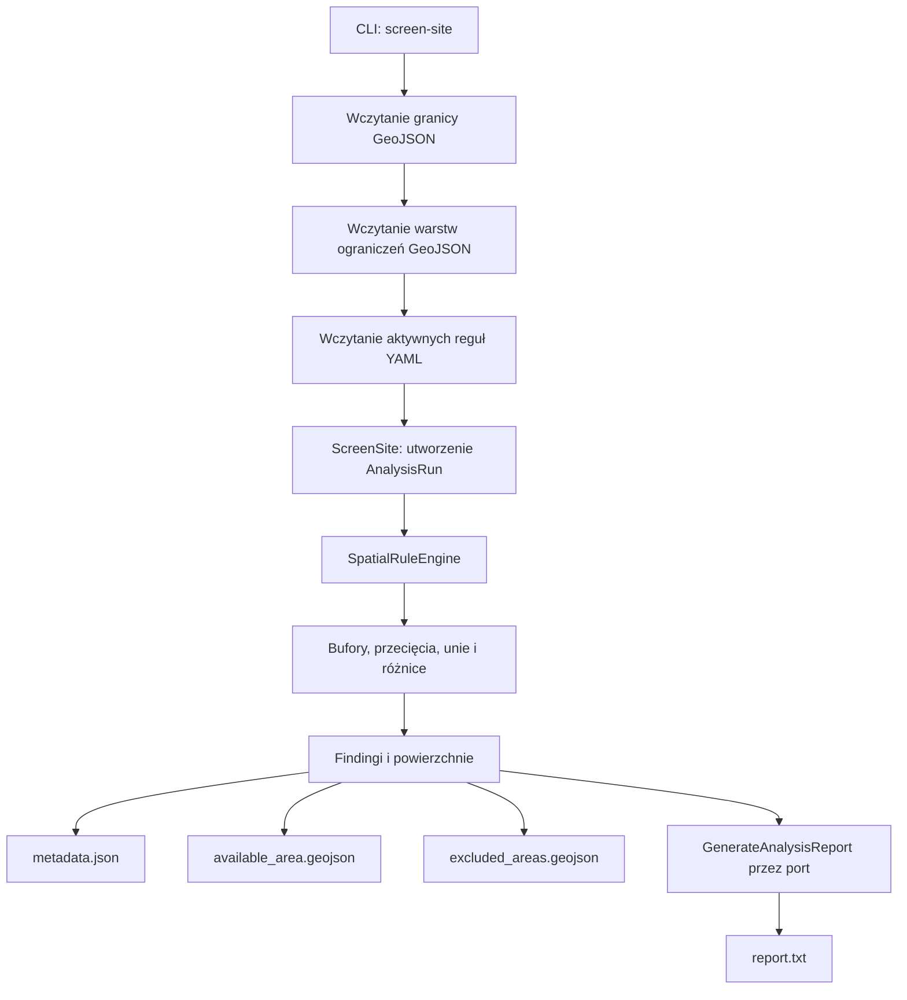

# Architektura

## Podejście

System jest modularnym monolitem z architekturą portów i adapterów. Logika
domenowa nie zna GeoPandas, PyProj, PyWake, pvlib, bazy danych ani frameworka
interfejsu.

## Warstwy

1. **Domain** — niemutowalne modele `Project`, `Site`, `Scenario`,
   `SpatialConstraint`, `EnergyProfile`, `AnalysisRun`, `ConstraintFinding`,
   `WindTurbine`/`WindSimulationResult`, `SolarModule`/`SolarSimulationResult`,
   `Battery`/`BatteryDispatchResult`, `GridConnectionLimit`,
   `HybridProductionResult` oraz neutralne reprezentacje geometrii i CRS.
2. **Application** — przypadki użycia `ScreenSite`, `GenerateAnalysisReport`,
   `GenerateTurbineLayout`, `SizeSolarArray`, `AggregateHybridProduction`,
   `DispatchBattery`; koordynują repozytoria, dostawców danych, evaluator
   reguł i generator raportu.
3. **Ports** — protokoły repozytoriów, dostawców warstw, reguł i zasobów
   (wiatr, nasłonecznienie), operacji przestrzennych, symulatorów
   (`WindFarmSimulator`, `SolarArraySimulator`) oraz
   `AnalysisReportGenerator`.
4. **Adapters** — pliki GeoJSON/YAML, GeoPandas, Shapely, PyProj, raport
   tekstowy, wbudowane symulatory wiatru/PV, opcjonalne adaptery PyWake i
   pvlib, repozytoria w pamięci (`adapters/memory_repositories.py`, używane
   przez API). Adaptery plikowe składają zależności dla CLI i Streamlit
   przez wspólny `composition.py`.
5. **Interfaces** — CLI (`cli.py`), formularz Streamlit (`streamlit_app.py`,
   schematyczny podgląd SVG bez georeferencji) i proste API webowe
   (`api/`, FastAPI, opcjonalny extra `web`, repozytoria w pamięci — patrz
   [WEB_ARCHITECTURE.md](WEB_ARCHITECTURE.md)). Frontend React + MapLibre z
   realną mapą jest planowany, ale nie jest jeszcze zaimplementowany.

## Przepływ screeningu

Przypadek użycia zapisuje wersje reguł i warstw w `AnalysisRun`, a następnie
przekazuje wynik do raportowania. Adapter raportu nie wykonuje obliczeń GIS.

## Moduły technologiczne

Moduły wind, solar, storage, grid i hybrid pozostają niezależne (jako pliki
domenowe/adaptery/przypadki użycia per technologia, nie osobne pakiety
`technologies/*`) i wymieniają wyniki przez wspólny model `EnergyProfile`:
`sum_profiles` agreguje profile per turbina/moduł w profil farmy, a
`AggregateHybridProduction` łączy profile wiatru i PV w jeden profil
hybrydowy, ograniczany limitem przyłącza (`GridConnectionLimiter`) i
wspierany przez magazyn (`DispatchBattery`).

## Zasady zależności

- interfejs wywołuje przypadki użycia, a nie GeoPandas ani zapytania do bazy;
- biblioteki zewnętrzne są ukryte za adapterami;
- port raportowania pozwala wymienić tekst na HTML lub PDF bez zmiany
  `ScreenSite` i warstwy aplikacyjnej;
- reguły prawne są danymi konfiguracyjnymi z wersją i okresem obowiązywania,
  a nie stałymi w algorytmie.
